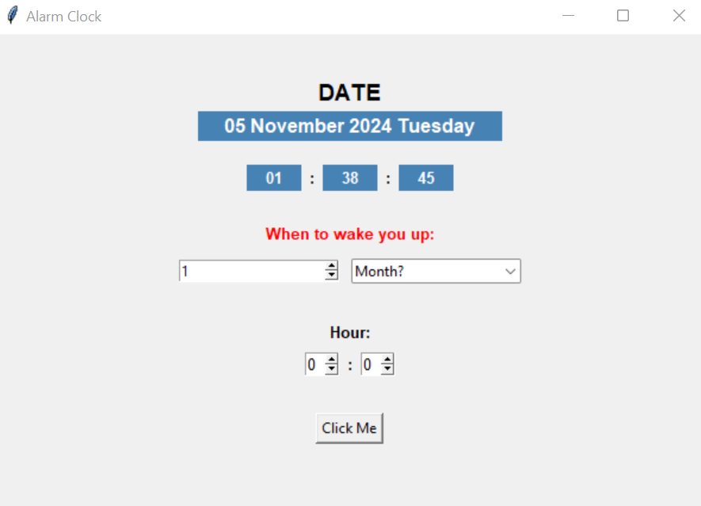

# Alarm Clock ⏰

Bu proje, kullanıcıların belirledikleri saat ve tarihe göre alarm kurmasını sağlayan kullanıcı dostu bir grafik arayüze sahip çalar saat uygulamasıdır.

## 📦 Geliştirme

Uygulamanın geliştirilmesinde kullanılan Python kütüphaneleri:

- `tkinter`: GUI uygulamaları geliştirmek için.
- `datetime`: Tarih ve saat bilgilerini işlemek için.

## 🚀 Nasıl Kullanılır?

1. Uygulamayı başlatın.
   ### GUI:
   
3. "When to wake you up:" başlığı altında tarih ve saat bilgilerinizi girin.
4. "Click Me" butonuna tıklayarak alarmınızı kurun.
5. Belirlediğiniz zamanda alarmınız çalacaktır.

## Notlar ⚠️

- Bu kodları çalıştırabilmek için Google Colab gibi araçlar kullanılamamaktadır. Lütfen bu projeyi çalıştırmak için Jupyter Notebook veya diğer benzer araçları kullanın. Bunun nedeni, `tkinter` gibi GUI kütüphanelerinin tarayıcı tabanlı ortamlarda çalışmamasıdır.
